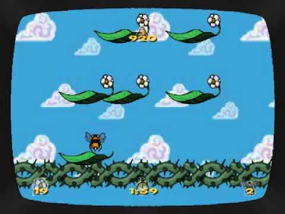

# Projeto FPro Let's Get Ready To Bumble
## FPRO/L.EIC, 2021/22
## Tomás Vicente (up202108717)
## 1L.EIC13

### Objetivo

1. Criar um clone do minijogo "Let's Get Ready To Bumble" (do Grand Theft Auto - San Andreas, da Rockstar Games) em Pygame

2. Em alternativa, o clássico o Zuma da PopCap Games em Pygame.

### Repositório de código

1) Link para o repositório do GitHub: https://github.com/tomasvicente3/FPro-Project

2) Adicionar, como colaborador com permissão de leitura (*role read*):

- https://github.com/AfonsoSalgadoSousa
- https://github.com/jlopes60
- https://github.com/nmacedo
- https://github.com/rpmcruz
- https://github.com/eSoares
- https://github.com/pbv
- https://github.com/imdcode
- https://github.com/acoelho-fe-up-pt

### Descrição

*---É um jogo de plataforma em que o objetivo do jogo é coletar flores em plataformas flutuantes, passando de nível quando não houver mais flores para coletar. 
Para coletar as flores basta encostar à mesma, com a abelha que o jogador controla. 
Porém se a abelha tocar nos espinhos, o jogador perde uma vida e o nível reinicia---*

### UI

### Pacotes

- Pygame

### Tarefas

1. agrupar as imagens, prontas a usar (concluído)
2. criar o ecrã (HUD) (concluído)
3. construir os controlos da abelha (concluído)
4. criar um conjunto de níveis
5. pontuar o jogador com base no tempo e flores, limitando as vidas (concluído)
6. adicionar um menu inicial e sequência de "game over", com possível tabela de "high-scores"

- Atualizado a última vez em 11/01/2022
